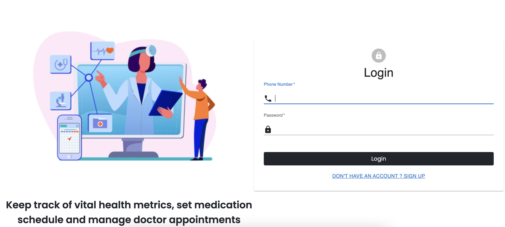
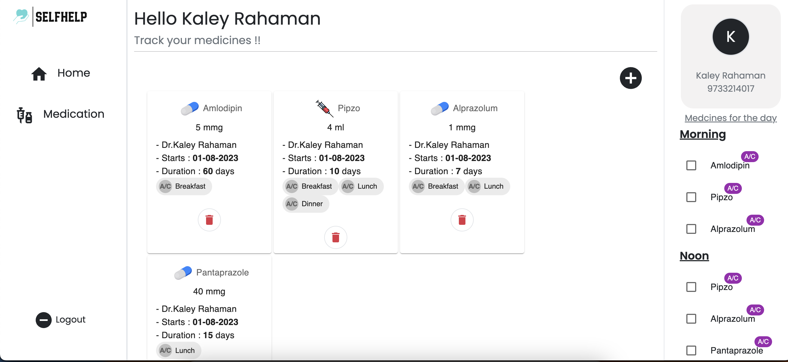
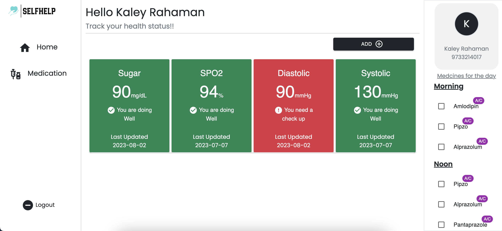

# SelfHelp

> Web Application designed to track personal health and medcicines.
> The app allows you to effortlessly track your vital health signs and monitor medication routines.
> It facilitates to manage entire records of ongoing medicines with all the required infomation like name,dosage,starting date,duration.
> Users gets the medicine list for the day where one can mark
> each medication as "completed" once you've taken your prescribed dose.

## [Hosted URL link](https://selfhelp-india.netlify.app/)

### [Github repository of the backend API.](https://github.com/sandipansaha1998/selfhelp_api)

### Features

- [x] User session management and authentication.
- [x] Add , track and visualise vitals using cards.
- [x] Create,Read and Delete medicines
- [x] Medicine List for current date.
- [x] Single tap to mark a medication dosage completed.

### Demo


### Screen Shots

#### Login



#### Medicine Inventory



#### Vital Dashboard



### Tech Stack

> MongoDb,Express.js,Node.js,React.js

# To run this project locally :

## Install Dependencies

### `npm install`

In the project directory, you can run:

### `npm start`

Runs the app in the development mode.
Open [http://localhost:3000](http://localhost:3000) to view it in your browser.

### Directory Structure

```
├── package-lock.json
├── package.json
├── public
│ ├── index.html
│ ├── manifest.json
│ └── robots.txt
└── src
├── api
│ └── index.js
├── assets
│ ├── brand.png
│ ├── landing_illus.png
│ ├── pill.png
│ ├── syringe.png
│ └── syrup.png
├── components
│ ├── App.js
│ ├── Input
│ │ ├── DosageTimmingInput.js
│ │ ├── Input.js
│ │ ├── MedicineIntake.js
│ │ └── SelectInput.js
│ ├── LandingPage
│ │ ├── Home.js
│ │ ├── VitalCard.js
│ │ ├── VitalFormModal.js
│ │ └── Vitals.js
│ ├── Medicine
│ │ ├── MedicineCard.js
│ │ └── MedicineForm.js
│ ├── Misc
│ │ ├── Loader.js
│ │ └── Notification.js
│ └── SideBar
│ ├── LeftSideBar.js
│ └── RightSideBar.js
├── hooks
│ └── index.js
├── index.css
├── index.js
├── pages
│ ├── Auth.js
│ ├── LandingPage.js
│ ├── Medicine.js
│ └── index.js
├── providers
│ └── AuthProvider.js
├── styles
│ └── App.css
└── utils
└── index.js
```
